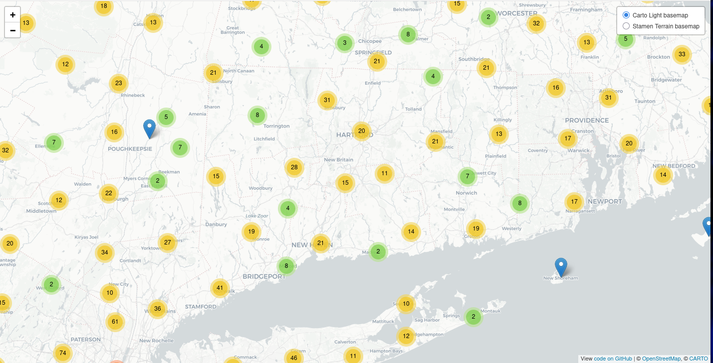

# Post Office Map Leaflet
Using Leaflet to render markers of every post office in the United States.
Data sourced from the [Post Offices Esri Federal Dataset](https://hub.arcgis.com/datasets/fedmaps::post-offices/explore)

## Easy Startup
cd post-office-map-leaflet
npx live-server

For more information on customization, see [Leaflet documentation](https://leafletjs.com/).

## HandsOnDataViz Tutorial
https://handsondataviz.org/leaflet-maps-with-csv.html

## See other Leaflet templates
* [Simple Leaflet map](https://github.com/HandsOnDataViz/leaflet-map-simple)
* [Leaflet map with open data APIs](https://github.com/HandsOnDataViz/leaflet-maps-open-data-apis)
* [Leaflet map with data from Socrata](https://github.com/HandsOnDataViz/leaflet-socrata)
* [Leaflet polygon map with tabs](https://github.com/HandsOnDataViz/leaflet-map-polygon-tabs)
* [Leaflet heatmap](https://github.com/HandsOnDataViz/leaflet-heatmap)
* [Searcheable Map Template](https://github.com/HandsOnDataViz/searchable-map-template-csv)
* [Leaflet Maps with Google Sheets](https://github.com/HandsOnDataViz/leaflet-maps-with-google-sheets)
* [Leaflet Storymaps with Google Sheets](https://github.com/HandsOnDataViz/leaflet-storymaps-with-google-sheets)
